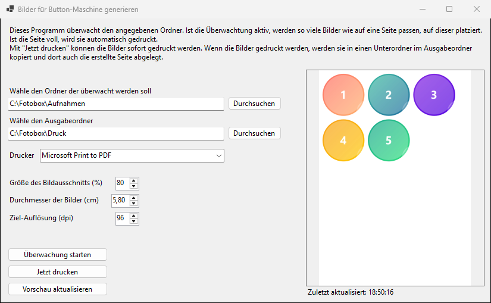

# PrintImageForButtonMachine

Windows-Programm, das Fotos für eine Buttonmaschine druckfertig aufbereitet. Es überwacht einen Ordner, in dem z. B. eine Fotobox ihre Aufnahmen ablegt, schneidet jedes Foto kreisrund zu und ordnet die Kreise auf einer A4-Seite an. Sobald die Seite voll ist, wird sie automatisch gedruckt.



## Funktionen

- **Ordnerüberwachung:** prüft alle 2 Sekunden den überwachten Ordner auf neue `*.jpg`-Dateien
- **Live-Vorschau** der aktuellen Seite, wird nur bei Änderungen neu berechnet
- **Automatischer Druck**, sobald so viele Bilder vorhanden sind, wie auf eine Seite passen
- **Manueller Druck** über „Jetzt drucken“, auch wenn die Seite noch nicht voll ist
- **Archivierung:** Vor dem Druck werden die Fotos in einen Unterordner mit Zeitstempel im Ausgabeordner verschoben; die gedruckte Seite wird dort als `print.jpg` abgelegt

## Einstellungen

| Einstellung | Bedeutung |
|---|---|
| Überwachter Ordner | Ordner, in dem neue Fotos erwartet werden |
| Ausgabeordner | Ziel für die verschobenen Fotos und die gedruckten Seiten; muss sich vom überwachten Ordner unterscheiden |
| Drucker | Drucker, auf dem die Seiten ausgegeben werden |
| Größe des Bildausschnitts (%) | Anteil der kürzeren Bildkante, der als Kreis aus der Bildmitte ausgeschnitten wird |
| Durchmesser der Bilder (cm) | Durchmesser der Kreise auf der gedruckten Seite, passend zur Buttongröße |

Während die Überwachung läuft, sind die Einstellungen gesperrt.

## Voraussetzungen

- Windows 10 oder 11
- [.NET 10 Desktop Runtime](https://dotnet.microsoft.com/download/dotnet/10.0) zum Ausführen, bzw. das .NET 10 SDK zum Bauen

## Bauen und Starten

```powershell
dotnet build
dotnet run --project PrintImageForButtonMachine
```

Alternativ `PrintImageForButtonMachine.sln` in Visual Studio 2026 öffnen.

Eine eigenständige Programmdatei, die ohne installierte Runtime läuft, erzeugt:

```powershell
dotnet publish PrintImageForButtonMachine -c Release -r win-x64 --self-contained -p:PublishSingleFile=true
```
